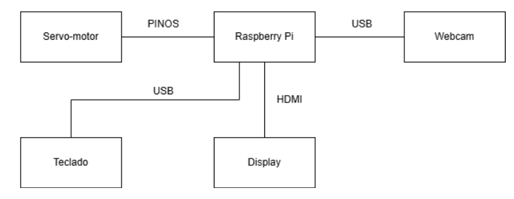
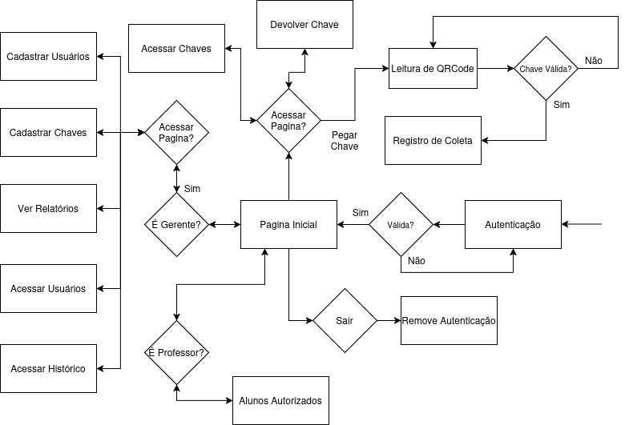

# Quadro Inteligente para Gerenciamento de Chaves

## Visão Geral
Este projeto propõe a criação de um **quadro inteligente** para o gerenciamento seguro e eficiente das chaves no IFPB-CG. O sistema busca minimizar os riscos de perda e uso indevido das chaves por meio de um controle automatizado e integrado a uma plataforma web.

## Problema Atual
**Falta de rastreabilidade:** Não é possível saber quem retirou ou devolveu uma chave.

**Controle manual:** Dependência de registros físicos (papel) ou sistemas não integrados.

**Risco de perda ou uso indevido:** Chaves podem ser retiradas sem autorização ou perdidas sem registro.

## Justificativa
Considerando as limitações do atual sistema de controle de chaves no IFPB-CG, que opera de maneira rudimentar e apresenta brechas para questões de segurança, este projeto propõe uma solução inovadora: um quadro inteligente para o gerenciamento seguro e eficiente das chaves. O objetivo é oferecer uma alternativa que minimize os riscos de perda e uso indevido das chaves, promovendo um controle mais confiável e organizado.

O quadro inteligente será equipado com diversos ganchos, cada um destinado a uma chave específica. Cada chave terá um chaveiro exclusivo com QR code associado, facilitando sua identificação e registro. Para reforçar a segurança, o quadro contará com uma trava que será liberada a partir da leitura de uma senha. Isso impedirá a abertura por qualquer pessoa que não possua autorização para acessar pelo menos uma chave no sistema.

Este sistema de controle será integrado a uma plataforma web, onde os usuários poderão fazer login para acessar as funcionalidades do quadro inteligente. Uma vez autorizados, eles poderão abrir o quadro e escanear o QR code da chave que desejam retirar. Os usuários serão recebedores, incluindo professores, alunos e funcionários, que poderão retirar e transferir chaves conforme necessário.

Além disso, o sistema permitirá a transferência de chaves entre recebedores, seguindo o mesmo processo de escaneamento e registro. Isso garante que, em todos os momentos, os usuários autorizados saibam com quem estão as chaves, aumentando a rastreabilidade e a segurança no uso dos recursos. Também será possível gerar relatórios sobre a utilização de salas e laboratórios.

## Objetivo Geral
Desenvolver um **sistema seguro** para o gerenciamento de chaves no IFPB-CG, utilizando um **quadro inteligente** com controle de acesso, rastreabilidade e integração com uma plataforma web.

## Objetivos Específicos

### 1. Garantir a rastreabilidade das chaves
- Implementar um sistema de registros digital que permita identificar **quem retirou, devolveu ou transferiu uma chave** em tempo real.

### 2. Aumentar a segurança no acesso às chaves
- Integrar **controle de acesso por senha** para evitar retiradas não autorizadas.
- Desenvolver um **mecanismo de trava eletrônica** para liberar o quadro apenas para as pessoas autorizadas.

### 3. Automatizar o processo de retirada e devolução
- Criar um fluxo eficiente de uso das chaves utilizando **QR codes**, reduzindo a necessidade de registros manuais.
- Permitir a **transferência de chaves entre usuários** de forma segura e registrada.

### 4. Facilitar a gestão e o monitoramento
- Desenvolver uma plataforma web para **visualização em tempo real do status das chaves**.
- Permitir a geração de **relatórios de uso** para auditoria e tomada de decisões.

### 5. Melhorar a organização e eficiência operacional
- Eliminar **registros físicos** e centralizar o controle das chaves em um único sistema.
- Garantir a **disponibilidade do sistema** para que o acesso às chaves seja feito de maneira prática e eficiente.

## Benefícos
### Segurança
- Acesso controlado por senha e autenticação de usuários.
- Rastreabilidade completa de todas as transações de chaves.
### Eficiência
- Eliminação de registros manuais.
- Processo rápido e automatizado de retirada e devolução de chaves.
### Organização
- Controle centralizado de todas as chaves.
- Relatórios detalhados para tomada de decisões.
### Rastreabilidade
- Registro completo de quem retirou, devolveu ou transferiu uma chave.
- Facilidade para auditorias e monitoramento.

## Funcionalidades
- **Registro de Chaves e Usuários**: Cadastro de chaves com QR code e usuários autorizados.
- **Controle de Acesso ao Quadro**: Trava de segurança que permite acesso apenas a usuários autorizados.
- **Retirada de Chaves**: Registro da retirada de chaves através da leitura de QR code.
- **Transferência de Chaves**: Transferência de chaves entre usuários.
- **Registro e Rastreabilidade**: Histórico completo das movimentações de chaves.
- **Gestão e Relatórios**: Relatórios sobre a utilização de chaves e salas.

----

## Requisitos
### Requisitos Funcionais
| ID  | Descrição | Prioridade |
|-----|------------|------------|
| RF1 | Cadastro de chaves e usuários | Crítico |
| RF2 | Trava de segurança para acesso ao quadro | Crítico |
| RF3 | Retirada de chaves com QR code | Crítico |
| RF4 | Transferência de chaves entre usuários | Alto |
| RF5 | Histórico de movimentação de chaves | Médio |
| RF6 | Relatórios para administradores | Médio |

### Requisitos Não-Funcionais
| ID | Descrição | Prioridade |
|----|------------|------------|
| RNF1 | HTTPS, autenticação em 2 fatores e criptografia de dados | Crítico |
| RNF2 | Interface intuitiva e responsiva | Alto |
| RNF3 | Disponibilidade do sistema 24/7 | Médio |
| RNF4 | Resposta rápida no login e abertura da trava | Crítico |
| RNF5 | Suporte para navegadores e dispositivos móveis | Alto |

## Materiais Utilizados
- Quadro com ganchos para as chaves
- Chave com QR code
- Raspberry Pi 4B
- Webcam
- Jumpers
- Fonte de alimentação
- Cabo Hdmi
- Teclado
- Mouse
- Display
- Servo motor

## Tecnologias Utilizadas
- **Hardware**: Raspberry Pi, Display, Servo Motor, Webcam
- **Software**: Plataforma Web, Banco de dados
- **Linguagens**: Python, Flask, JavaScript, HTML, CSS, MySQL
- **Comunicação**: HTTP

----
## Diagrama de Blocos da Solução Proposta

## Fluxograma de Operação

